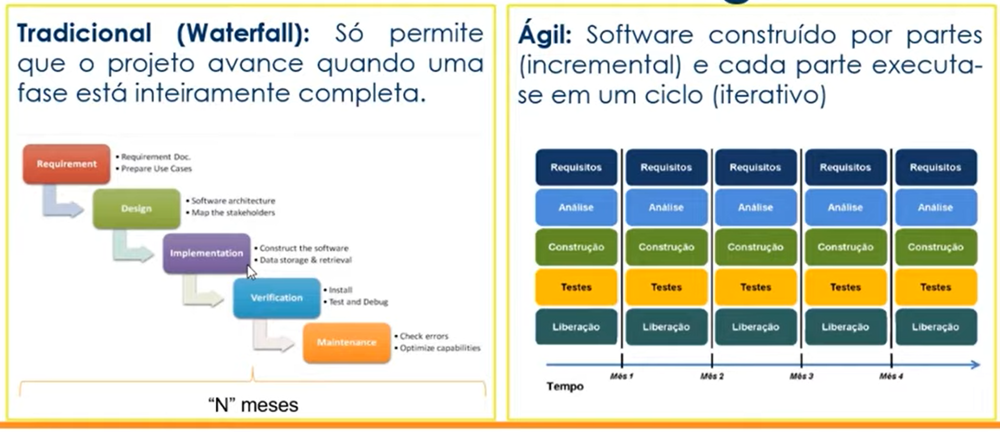
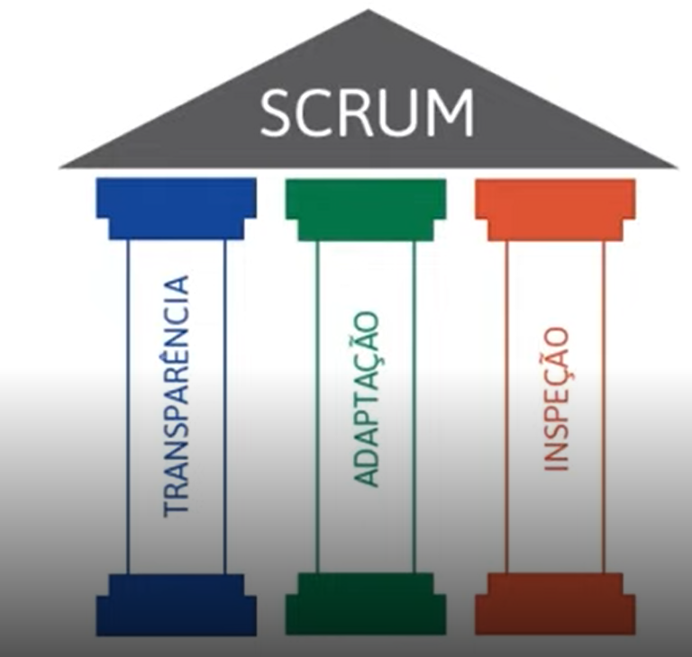

# SCRUM

## Conceitos Básicos

### Tradicional X Ágil
| Tradicional                                                   | Ágil                                                                       |
| ------------------------------------------------------------- | -------------------------------------------------------------------------- |
| Escopo definido na fase inicial do Projeto (Preditivo)        | Escopo definido ao longo do Projeto (Adaptativo)                           |
| Projeto é controlado por fases e marcos                       | Projeto é controlado por funcionalidades entregues                         |
| Cliente só vê o software funcionando na fase final do Projeto | Cliente pode ver parte do software funcionando na parte inicial do Projeto |
| Resistência a mudanças                                        | Mudanças constantes de acordo com feedbacks contínuos                      |

Resumo:
Em projetos tradicionais, pode correr o risco de descobrir erros depois de meses. Com o SCRUM, pode ser descoberto em no máximo em 30 dias.

O que é ser Ágil?
Nesse caso ágil é diferente de rápido

- Rapidez (mudança) e desembaraço
- Fazer coisas complexas de forma simples
- Equipe comprometida com os objetivos
- Maior valor para o cliente

SCRUM é um framework de gerenciamento de projetos ágeis.
Projetos usando equipes pequenas e multidisciplinares para produzir os melhores resultados

- Conversar mais e escrever menos
- Demonstrar o software constantemente aos usuários e obter feedbacks
- Requisitos mudam ao longo do tempo
- Aprender progressivamente com o uso do software

Razões para utilização do SCRUM

- Desenvolvido e entregue em partes menores (2 a 4 semanas) com feedbacks constantes
- Melhor gerenciamentos de riscos, com redução de incertezas
- Comprometimento, motivação e transparência em equipe (Daily Meeting)
- Maior valor para negócio 
- Usuário envolvidos durante todo o ciclo
- Aplicação das lições aprendidas ()

Características do time SCRUM

- Equipes capazss de se auto-organizarem
- Tarefas são do times e todos são responsáveis
- Forte comprometimento com os resultados

Trabalham com o MVP (Minimum Viable Product)

## Papéis e responsabilidades

Product Owner (PO):
- Representa a área de negócio
- Uma pessoa
- Define as funcionalidades do software (Product Backlog)
- Prioriza as funcionalidades de acordo com o valor do negócio
- Garante que o time de desenvolvimento entenda os itens de backlog

Scrum Master (SM):
- Garante o uso correto do SCRUM
- Não é gerente de projeto
- Age como facilitador
- Auxilia o PO no planejamento e estimativas do backlog
- Auxilia o time a remover impedimentos
- Treina o time em autogerencimento e interdisciplinaridade
  
Time de desenvolvimento (DEV)
- Habilidades para desenvolver, testar, criar e desenhar, ou seja, tudo que for necessário para entergar o software funcionando

## Cerimônias do SCRUM

Time Box: Tempo máximo definido para fazer uma cerimônia ou sprint

Sprint: Principal evento do SCRUM, duração de 30 dias corridos. O tempo da cada sprint é definido pelo SM e pelos DEVs

Composição de uma sprint:
- Planejamento da Sprint (Sprint Planning)
  - PO, SM e DEV. O que fazer? e como Fazer?. Time Box: 8h
  - Planning Poker
- Reuniões diárias (Daily Meeting)
  - PO, SM e DEV: O fez, o vai fazer e impedimentos. Time Box: 15 min
- Revisão da Sprint (Sprint Review)
  - Ultimo dia
  - Time DEV apresenta para o PO o trabalho feito
  - Time Box: 4h
- Retrospectiva da Sprint
  - PO, SM e DEV. Reunião com transparência para apresentar lições aprendidas. Time Box: 3h
  - Observações: O que foi bom? e O que foi ruim? 
  - Ações: Fazer mais, Tentar, Fazer menos

Product Backlog
- Composto por épicos e estórias
  - Épicos: Incremento sem muito detalhamento, ajuda a direcionar nos caminhos seguintes.
  - Estórias: Detalhamento dos épicos, sendo que um épico normalmente se divide em várias estórias, onde ficam descritos o que deve acontecer e suas regras de negócios

### Épico tem Estórias que tem Tarefas

Critério de Aceite
- Lista de critérios que precism ser alacançadas para que o User Story atenda os requisitos do usuário e seja aceita pelo Product Owner
- Objetivos:
  - Definir limites
  - Ajudar PO a detalhar em alto nível o que é necessário para entregar valor ao cliente

