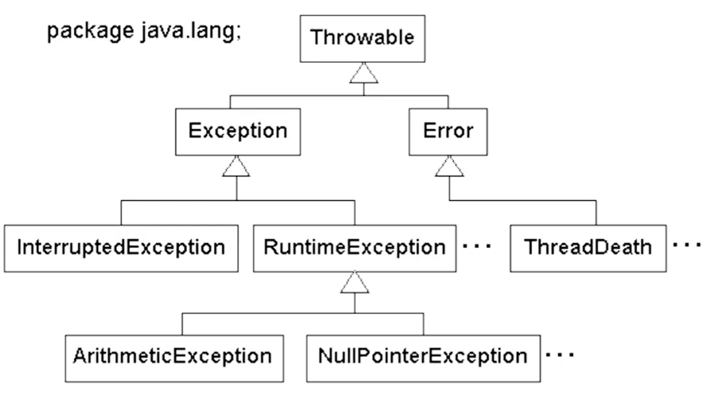

# Tratamento de exceções

Exceções são erros que occorrem durante o processamento de um método que pode ser esperados como não esperados.

## Exceções esperadas e não esperadas

- Exceção esperada (Cheked Exception)
  - Exceções que o fluxo de um sistema foi preparado para receber. Ex: uma exceção de negócio, onde se deseja unformar um erro caso a exceção ocorra

- Exceção não esperada (Uncheked Exception)
  - Exceções que o fluxo não está preparado para receber. Famosa NullPointException.

Bloco try-catch
- Quis adipisicing do minim nulla sit deserunt occaecat aute magna nostrud do qui irure.

# finally e throw
- finally é colocado depois do cath, para liberar algum recurso, já que ele é executado sempre no final 
- throws: assinatura do métodos que será retornado caso ocorra um erro
- throw: usado para lançar a exceção desejada, junto com a mensagem de erro